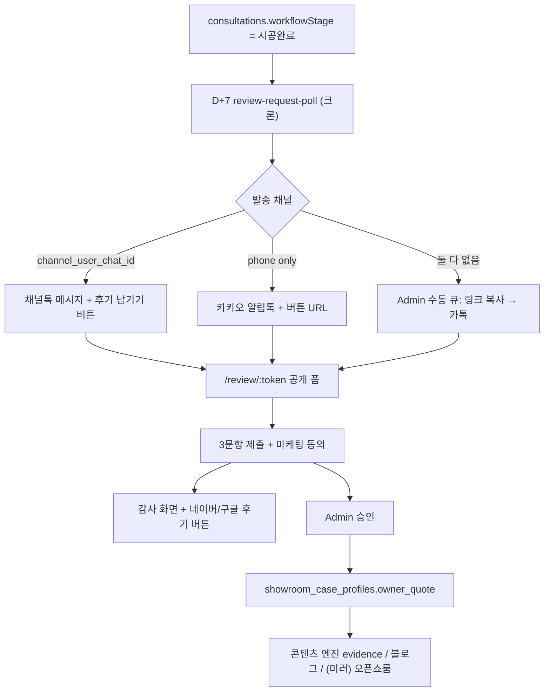

# 고객 후기 수집·활용 블루프린트

> 시공 완료 고객으로부터 **실제 후기(원장/담당자 한 줄)** 를 자동으로 요청·저장·승인하고, 콘텐츠·쇼룸에 재활용하기 위한 실행 기준 문서입니다.  
> 현재 구현 기준서: `BLUEPRINT.md` · 관련 흐름: `docs/FINDGAGU_PRODUCT_FLOW.md` · 콘텐츠 엔진·오픈쇼룸은 별도 단계로 연결합니다.

## 1. 배경과 문제

### 현재 상태

- `showroom_case_profiles`에 `owner_quote`, `operator_review` 컬럼은 있으나 **`owner_quote`는 UI·파이프라인에 미연결**입니다.
- 쇼룸·홈페이지에 보이는 「운영자 관점」 문구는 `caseProfiles.ts` **업종별 템플릿**에 가깝고, 실제 고객 인용이 아닙니다.
- 후기 **수집 채널·자동 요청·승인·공개 게이트**가 없어 마케팅·콘텐츠 신뢰도가 약합니다.

### 목표

1. **시공완료 D+7**에 관리자 개입 없이 후기 요청이 나간다.
2. 고객은 **1분 이내** 3문항(한 줄 위주)으로 답한다.
3. Admin **승인 후**만 `owner_quote` 및 공개 콘텐츠에 반영한다.
4. (선택) 제출 직후 **네이버·구글 외부 후기 버튼**으로 플랫폼 후기도 유도한다.
5. 승인된 후기는 **콘텐츠 엔진**(카드뉴스 evidence, 블로그, 숏츠) 연료로 쓴다.

### 우선순위 (다른 작업과의 관계)

- **콘텐츠 엔진 크론 자동화**와 병행 가능하나, 후기 수집은 **독립 Phase**로 먼저 착수 가능합니다.
- **오픈쇼룸 분리·미러링**은 후기 **승인·발행 게이트**와 함께 Phase 3 이후에 맞추는 것을 권장합니다.

---

## 2. 제품 한 줄 정의

`시공완료 → (카톡/채널톡) 후기 링크 → 웹 3문항 → Admin 승인 → owner_quote → 콘텐츠·쇼룸`

카카오톡의 역할은 **후기 작성 링크 전달**이며, 3문항 입력은 **모바일 웹 폼**(`/review/:token`)에서 처리합니다. (알림톡·친구톡에 임의 입력 폼을 넣을 수 없음)

---

## 3. End-to-End 흐름



---

## 4. 카카오·메시지 발송 전략

| 방식 | 대상 | 자동화 | 비고 |
|------|------|--------|------|
| **수동 카톡** | 모든 고객 | Admin 「후기 요청」→ URL 복사 | Phase 0, API 불필요 |
| **채널톡 API** | `channel_user_chat_id` 보유 | D+7 크론 | 기존 `sendChannelTalkMessage` 패턴 재사용 (`supabase/functions/channel-talk-webhook/index.ts`) |
| **카카오 알림톡** | `consultations.customer_phone` | D+7 크론 | 템플릿 심사·발송 대행(Solapi/NHN/채널톡 알림톡) 필요 |

### 발송 분기 (권장)

```
D+7 review-request-poll
  ├─ channel_user_chat_id 있음 → 채널톡 (버튼: 후기 남기기)
  ├─ 없음 + customer_phone 있음 → 알림톡 (버튼 URL)
  └─ 둘 다 없음 → review_requests.status = pending_manual (Admin 알림)
```

### 알림톡 템플릿 예시 (검수용 초안)

```
[파인드가구] 시공 후기 요청

#{고객명}님, 시공 공간은 잘 쓰고 계신가요?
한 줄 후기를 남겨주시면 다른 원장님께 큰 도움이 됩니다.

▶ 후기 남기기: #{review_url}
(약 1분 소요)
```

### 수동 카톡 메시지 예시

```
○○님, 시공 후 한 달 정도 지났는데 공간은 어떠신가요?
사례에 실어도 될 한 줄 후기만 부탁드립니다.
👉 {review_url} (1분)
```

---

## 5. 공개 후기 폼 (`/review/:token`)

### 3문항

1. 시공 전 가장 걱정했던 점 (한 줄, 필수)
2. 시공 후 가장 달라진 점 (한 줄, 필수)
3. 비슷한 업종 원장에게 한 마디 (선택)

### 동의

- 체크: 「익명/지역 마스킹 후 마케팅·사례 페이지에 사용해도 됩니다」(필수)

### 제출 후 — 외부 플랫폼 후기 버튼 (Phase 1b)

감사 화면에만 노출 (폼 본문 X, 부담 최소화):

- `[ 네이버 플레이스 후기 남기기 ]` → `VITE_NAVER_PLACE_REVIEW_URL` (새 탭)
- `[ 구글 비즈니스 후기 남기기 ]` → `VITE_GOOGLE_BUSINESS_REVIEW_URL` (새 탭)
- 문구: 「선택 사항입니다. 안 하셔도 괜찮아요.」
- 클릭 이벤트: `showroom_engagement_events` · `event_name = external_review_click` (선택)

---

## 6. 데이터 모델 (신규)

### `customer_review_requests`

| 컬럼 | 설명 |
|------|------|
| `id` | uuid |
| `consultation_id` | fk → consultations |
| `token` | 공개 URL용 (unique, url-safe) |
| `site_name` | 연결 현장명 (optional, 쇼룸 프로필 매칭) |
| `due_at` | 요청 예정 시각 (시공완료 + 7일) |
| `sent_at` | 실제 발송 시각 |
| `send_channel` | `channel_talk` \| `alimtalk` \| `manual` |
| `status` | `scheduled` \| `sent` \| `submitted` \| `approved` \| `rejected` \| `expired` |
| `expires_at` | 토큰 만료 (예: 발송 + 30일) |

### `customer_reviews`

| 컬럼 | 설명 |
|------|------|
| `id` | uuid |
| `request_id` | fk → customer_review_requests |
| `worry_before` | 문항 1 |
| `change_after` | 문항 2 |
| `recommend_line` | 문항 3 |
| `marketing_consent` | boolean |
| `submitted_at` | timestamptz |
| `approved_at` | timestamptz (nullable) |
| `approved_by` | text (nullable) |
| `owner_quote_composed` | 승인 시 합성한 한 줄 (nullable, Admin 편집 가능) |

### 기존 테이블 연동

- **`consultations`**: `workflowStage = 시공완료`, `customer_phone`, (optional) channel 연결 메타
- **`showroom_case_profiles.owner_quote`**: 승인 시 upsert
- **`channel_talk_leads`**: `channel_user_chat_id`로 채널톡 발송 대상 조회

### RLS 원칙

- `customer_review_requests`: token으로 **anon**은 `submit` RPC만 (행 직접 select 불가)
- `customer_reviews`: **authenticated** Admin만 read/update (승인)
- 공개 폼은 Edge Function 또는 `security definer` RPC로 제출

---

## 7. Admin UX

### 상담 관리 (`시공완료` 카드)

- **「후기 요청」** 버튼
  - 토큰 생성 (또는 기존 미제출 건 재사용)
  - 링크 클립보드 복사
  - (optional) 채널톡 즉시 발송
- **「후기 대기 / 제출됨 / 승인됨」** 배지

### 후기 승인 화면 (Admin)

- 3문항 원문 + **합성 `owner_quote` 미리보기** (편집 가능)
- 승인 / 반려
- 승인 시 `showroom_case_profiles.owner_quote` + `site_name` 매칭 upsert
- (optional) 케이스 작업실 deep link

---

## 8. 자동화 (크론)

### Edge Function: `review-request-poll`

- 트리거: `pg_cron` (예: 매일 09:00 KST) — 패턴은 `competitor-monitor-poll` / `20260609120000_schedule_competitor_monitor_cron.sql` 참고
- 조건:
  - `consultations.workflowStage = '시공완료'`
  - `status` not in (`거절`, `무효`)
  - 시공완료(또는 status `완료`) 기준 **+7일** 경과
  - 동일 `consultation_id`에 `customer_review_requests` 없음 또는 `status` not in (`submitted`, `approved`)
- 동작: request row 생성 → `review-request-send` 호출

### Edge Function: `review-request-send`

- 채널 분기 발송 (§4)
- 실패 시 `error_message` 기록, Admin 대시보드 또는 로그

---

## 9. 콘텐츠·쇼룸 재활용

승인된 `owner_quote` 활용처:

| 소비처 | 용도 |
|--------|------|
| 카드뉴스 | evidence 슬라이드 / 클로징 인용 |
| 블로그 정본 | 「원장 한마디」 섹션 |
| 숏츠 | 엔딩 자막 |
| 내부/공개 쇼룸 | `operator_review` 템플릿 대체 (공개는 **승인·미러 게이트** 후) |

콘텐츠 엔진 크론과의 연결: 후기 승인 이벤트 → (optional) 해당 `site_name` 콘텐츠 재생성 큐 enqueue.

---

## 10. 구현 Phase

| Phase | 범위 | 산출물 |
|-------|------|--------|
| **0** | 수동 카톡 | Admin 「후기 요청」+ `/review/:token` + DB + 승인 UI |
| **1a** | 자동 스케줄 | `review-request-poll` + 채널톡 자동 발송 |
| **1b** | 외부 후기 버튼 | 감사 화면 네이버/구글 + env URL + (선택) 클릭 트래킹 |
| **2** | 알림톡 | 템플릿 심사 + `review-request-send` alimtalk 분기 |
| **3** | 콘텐츠 연동 | 승인 → evidence/블로그 자동 반영 |
| **4** | 오픈쇼룸 미러 | 발행 스냅샷에만 `owner_quote` 노출 (`docs/SHOWROOM_APP_SPLIT_*` 와 정렬) |

---

## 11. 기존 코드 재사용

| 자산 | 경로 |
|------|------|
| 채널톡 메시지+버튼 | `supabase/functions/channel-talk-webhook/index.ts` · `sendChannelTalkMessage` |
| 고객 전화번호 | `consultations.customer_phone` |
| 시공완료 단계 | `src/pages/consultation/consultationManagementConstants.ts` |
| 후기 저장 컬럼 | `showroom_case_profiles.owner_quote` |
| 카톡 링크 공유 (직원용) | `src/lib/kakaoShare.ts` |
| 크론 패턴 | `supabase/functions/competitor-monitor-poll/` · `20260609120000_schedule_competitor_monitor_cron.sql` |
| Deploy hook (SEO) | `src/lib/triggerVercelDeployHook.ts` — 후기 반영 페이지 prerender 시 |

---

## 12. 비기능·운영

- **토큰**: 충분한 엔트ropy, 1회성 제출 (재제출은 Admin 재발송)
- **PII**: 공개 API에 `customer_phone` 노출 금지
- **알림톡**: 수신 동의·야간 발송 제한 준수 (상담·계약 시 정보성 수신 동의 정리)
- **측정**: `sent → opened(submit) → approved → external_review_click` 전환율

---

## 13. 미구현 체크리스트

- [ ] migration: `customer_review_requests`, `customer_reviews`
- [ ] RPC: `submit_customer_review(token, payload)`
- [ ] 페이지: `PublicReviewPage` · `/review/:token`
- [ ] Admin: 상담 카드 「후기 요청」·승인 UI
- [ ] Edge: `review-request-poll`, `review-request-send`
- [ ] pg_cron 스케줄 migration
- [ ] env: `VITE_NAVER_PLACE_REVIEW_URL`, `VITE_GOOGLE_BUSINESS_REVIEW_URL`
- [ ] (Phase 2) 알림톡 템플릿·발송 API secret
- [ ] (Phase 3) 콘텐츠 엔진 · `owner_quote` wiring
- [ ] (Phase 4) 오픈쇼룸 미러 발행 게이트

---

## 14. 관련 문서

- `BLUEPRINT.md` — §6 자동화 구조
- `docs/FINDGAGU_PRODUCT_FLOW.md` — 상담 → 후속 자동화 확장
- `docs/SHOWROOM_APP_SPLIT_IMPLEMENTATION_BLUEPRINT.md` — 공개 앱 분리
- `docs/SHOWROOM_APP_SPLIT_DATA_MODEL.md` — `visibility` / 발행 게이트
- `channeltalk_master_guide.md` — 채널톡·알림톡 API 개요
