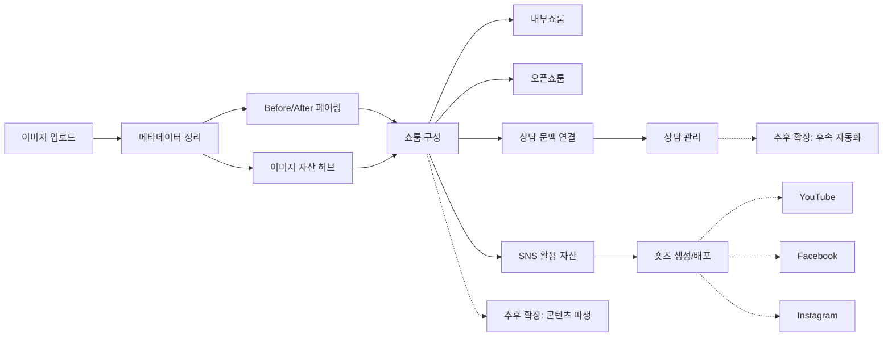
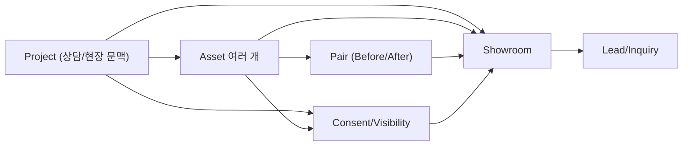
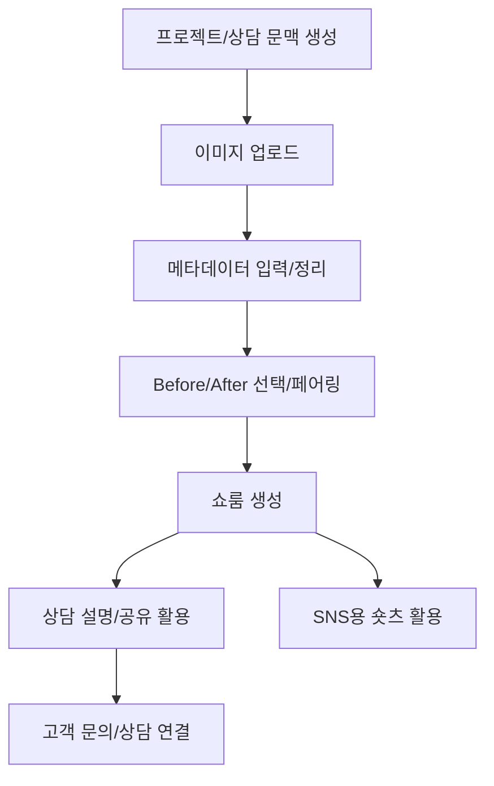

# FINDGAGU 제품 흐름 정리

이 문서는 `FINDGAGU OS`를 한눈에 설명하기 위한 제품 요약본입니다. 목적은 세 가지입니다.

- 제품의 큰 흐름을 보여주기
- 핵심 데이터가 어떻게 연결되는지 보여주기
- 실제 업무에서 어떻게 쓰이는지 보여주기

구현 근거는 `BLUEPRINT.md`, `CONTEXT.md`, `src/lib/showroomShorts.ts`, `src/lib/showroomShareService.ts`, `src/lib/imageAssetUploadService.ts`, `supabase/functions/channel-talk-webhook/index.ts`를 기준으로 정리했습니다.

## Executive Version
`FINDGAGU OS`는 현장 이미지를 단순 저장하지 않고, 상담과 쇼룸, 문의, SNS 활용까지 이어지는 운영 자산으로 바꾸는 시스템입니다.

핵심 흐름은 `이미지 업로드 -> 메타데이터 정리 -> before/after 페어링 -> 쇼룸 생성 -> 상담 연결 -> SNS 활용`입니다.

핵심 가치는 세 가지입니다.

- 흩어진 현장 이미지를 재사용 가능한 자산으로 바꿉니다.
- 같은 사례 문맥을 내부 설명, 외부 쇼룸, 고객 문의에 일관되게 연결합니다.
- 같은 자산을 쇼룸과 숏츠까지 확장해 마케팅 활용도를 높입니다.

## 1. 제품 구조도
한 줄 목적: 무엇이 들어오고, 내부에서 어떻게 가공되며, 무엇이 나가는지 보여주기.

### 핵심 설명
- 입력은 `이미지 업로드`와 `현장/상담 문맥`입니다.
- 시스템은 업로드된 이미지를 `메타데이터 정리`, `before/after 페어링`, `쇼룸 구성`, `상담 연결`의 순서로 재구성합니다.
- 출력은 `내부쇼룸`, `오픈쇼룸`, `상담 문맥`, `SNS용 숏츠/배포 자산`입니다.
- 추후 확장 영역은 `추가 채널 자동화`, `콘텐츠 파생`, `고객 행동 기반 후속 자동화`입니다.

### 발표용 카피
제목: 현장 이미지를 상담과 쇼룸, 문의, SNS까지 연결하는 운영 흐름

본문:
- 이미지는 업로드되는 순간 끝나는 데이터가 아니라, 나중에 다시 꺼내 쓸 수 있는 자산이 됩니다.
- 이 자산은 메타데이터와 before/after 문맥을 통해 쇼룸으로 재구성됩니다.
- 완성된 쇼룸은 상담 설명, 외부 공개, 문의 전환, 숏츠 활용까지 이어집니다.

### 다이어그램 원본

### 표현 포인트
- `이미지 -> 자산` 전환이 핵심입니다.
- `쇼룸`은 단순 갤러리가 아니라 연결 허브입니다.
- 점선은 미래 확장 영역만 표시해 현재 범위와 구분합니다.

## 2. 핵심 데이터 구조
한 줄 목적: DB 전체가 아니라, 제품을 이해하는 데 필요한 핵심 엔티티와 관계를 보여주기.

### 핵심 설명
- `Project`: 실무적으로는 상담/현장 문맥입니다.
- `Asset`: 업로드된 이미지 자산입니다.
- `Pair`: before/after 관계를 담는 연결 단위입니다.
- `Showroom`: 자산과 문맥으로 구성된 사례 묶음입니다.
- `Lead/Inquiry`: 쇼룸을 본 뒤 발생하는 고객 문의입니다.
- `Consent/Visibility`: 무엇을 외부에 보여줄지 정하는 공개 제어 계층입니다.

### 발표용 카피
제목: 데이터는 쌓이는 것이 아니라 연결되어야 합니다

본문:
- 하나의 현장 문맥 아래 여러 이미지가 쌓이고, 일부는 before/after 스토리로 묶입니다.
- 이 자산과 문맥이 결합되어 쇼룸이 만들어집니다.
- 고객은 쇼룸을 본 뒤 문의를 남기고, 그 문의는 다시 상담 흐름으로 연결됩니다.

### 다이어그램 원본

### 관계 설명
- 하나의 `Project`에는 여러 `Asset`이 연결됩니다.
- 여러 `Asset` 중 일부가 `Pair`로 묶여 전후 스토리를 만듭니다.
- `Showroom`은 `Project + Asset + Pair` 조합으로 생성됩니다.
- 고객은 `Showroom`을 본 뒤 `Lead/Inquiry`를 남깁니다.
- `Consent/Visibility`는 어떤 자산과 문맥을 외부에 보여줄지 결정합니다.

### 구현 대응
- `Project`: `consultation_id`, `space_id` 등 상담/현장 메타
- `Asset`: `image_assets` 계열
- `Pair`: `before_after_role`, `before_after_group_id`
- `Showroom`: 공개 RPC, 공유 링크, 내부/외부 쇼룸 UI
- `Lead/Inquiry`: `channel_talk_leads`, 상담 연결 문맥
- `Consent/Visibility`: 공개 가능 여부, 외부 표시명, 공유 링크 범위

## 3. 사용 흐름
한 줄 목적: 사용자가 실제 업무에서 어떤 순서로 제품을 쓰는지 보여주기.

### 핵심 설명
1. 담당자가 `프로젝트/상담 문맥`을 만듭니다.
2. 현장 이미지를 업로드합니다.
3. 이미지 메타데이터를 정리합니다.
4. before/after 후보를 선택해 페어링합니다.
5. 내부쇼룸 또는 오픈쇼룸을 만듭니다.
6. 쇼룸을 상담 중 설명과 공유에 활용합니다.
7. 고객 문의가 들어오면 상담 문맥으로 연결합니다.
8. 필요하면 같은 자산으로 숏츠를 만들고 SNS에 활용합니다.

### 발표용 카피
제목: 실제 업무에서는 이렇게 사용됩니다

본문:
- 현장 이미지가 먼저 쌓이고, 그다음에 메타와 전후 관계가 정리됩니다.
- 정리된 자산은 쇼룸이 되어 상담 설명과 외부 공유에 바로 쓰입니다.
- 필요하면 같은 자산으로 숏츠까지 만들어 고객 유입을 확장합니다.

### 다이어그램 원본

## 슬라이드 구성 제안
- 슬라이드 1: `제품 구조도`
  - 제목: 현장 이미지를 운영 자산으로 바꾸는 흐름
  - 서브카피: 업로드된 이미지가 쇼룸과 상담, 문의, SNS 활용까지 연결됩니다.
- 슬라이드 2: `핵심 데이터 구조`
  - 제목: 데이터는 저장보다 연결이 중요합니다
  - 서브카피: 프로젝트, 이미지, before/after, 쇼룸, 문의가 하나의 사례 문맥으로 이어집니다.
- 슬라이드 3: `사용 흐름`
  - 제목: 실무에서는 이렇게 사용됩니다
  - 서브카피: 프로젝트 생성부터 이미지 업로드, 쇼룸 활용, 고객 문의, SNS 확장까지 한 흐름으로 작동합니다.

## 한 문장 요약
`FINDGAGU OS`는 이미지를 보관하는 시스템이 아니라, 현장 이미지를 사례 문맥으로 연결해 상담과 쇼룸, 문의, SNS 활용까지 이어주는 운영 시스템입니다.
