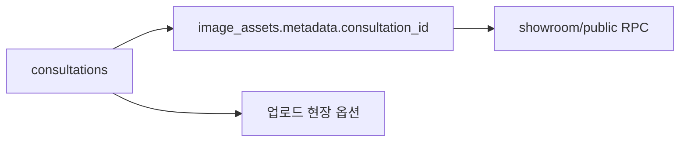
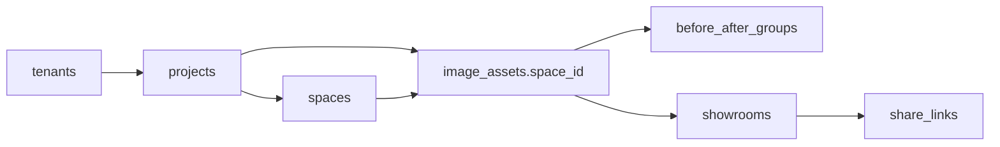

# 이미지 쇼룸 분리 판매용 데이터 모델 / 권한 설계

이 문서는 `상담관리 기반 구조`에서 `프로젝트/스페이스 기반 구조`로 전환하기 위한 데이터 모델과 멀티테넌시 설계를 정리합니다.

핵심 목적은 네 가지입니다.

- `consultations` 의존을 제거하기
- 판매용 제품의 기본 엔티티를 재정의하기
- `tenant_id` 기반 권한 모델을 제안하기
- 마이그레이션 순서를 실제 개발 가능한 수준으로 정리하기

## 1. 현재 구조의 문제

현재 이미지 자산과 쇼룸 축은 기능상 분리 가능하지만, 데이터는 아래 결합에 묶여 있습니다.

- `image_assets.metadata.consultation_id`
- 업로드 옵션 생성 시 `consultations.project_name` 조회
- 공개 RPC와 공유 링크가 내부 운영 DB와 같은 권한 평면에 존재
- `authenticated` 내부 운영 전제의 RLS

즉, 제품 분리의 핵심은 `상담관리 기능 제거`가 아니라 `데이터 기준점 변경`입니다.

## 2. 새 기준 엔티티

### 현재 기준

- `consultations`
- `image_assets`
- `showroom_share_links`
- `shared_gallery_links`

### 판매용 기준

- `tenants`
- `tenant_users`
- `projects`
- `spaces`
- `image_assets`
- `before_after_groups`
- `showrooms`
- `share_links`
- `lead_events` (선택)

## 3. 추천 엔티티 정의

### `tenants`

고객사 또는 브랜드 단위 최상위 소유자

주요 컬럼:
- `id`
- `name`
- `slug`
- `plan`
- `created_at`

### `tenant_users`

고객사 내부 로그인 사용자

주요 컬럼:
- `id`
- `tenant_id`
- `auth_user_id`
- `role`
- `created_at`

권장 role:
- `owner`
- `manager`
- `editor`
- `viewer`

### `projects`

상담이 아니라 `현장/사례/프로젝트`의 기본 단위

주요 컬럼:
- `id`
- `tenant_id`
- `name`
- `location`
- `business_type`
- `display_name`
- `status`
- `created_at`
- `updated_at`

설명:
- 기존 `consultation_id`가 담당하던 연결 기준을 이 테이블이 대체
- 외부 판매 제품에서는 프로젝트가 상담의 상위 개념이 아니라 사례의 상위 개념이 됨

### `spaces`

프로젝트 내부의 공간 단위

주요 컬럼:
- `id`
- `tenant_id`
- `project_id`
- `name`
- `display_order`
- `created_at`

### `image_assets`

이미지 자산 본체

추가/변경 권장 컬럼:
- `tenant_id`
- `project_id`
- `space_id`
- `asset_type`
- `visibility`

축소 권장:
- `metadata.consultation_id` 제거

유지 가능한 컬럼:
- URL
- 썸네일
- `before_after_role`
- `before_after_group_id`
- `is_main`
- 제품/색상/위치/업종 메타

### `before_after_groups`

Before/After 페어링 그룹

주요 컬럼:
- `id`
- `tenant_id`
- `project_id`
- `space_id`
- `title`
- `created_at`

### `showrooms`

공개/내부로 재사용되는 쇼룸 단위

주요 컬럼:
- `id`
- `tenant_id`
- `project_id`
- `space_id`
- `title`
- `summary`
- `visibility`
- `published_at`
- `created_at`
- `updated_at`

### `share_links`

공개 링크/토큰 단위

주요 컬럼:
- `id`
- `tenant_id`
- `showroom_id`
- `token`
- `scope`
- `expires_at`
- `created_at`

### `lead_events` (선택)

상담관리 전체 대신 남겨둘 경량 리드/행동 이벤트 테이블

주요 컬럼:
- `id`
- `tenant_id`
- `showroom_id`
- `share_link_id`
- `event_type`
- `visitor_key`
- `payload`
- `created_at`

## 4. consultation 의존 제거 방식

### 현재

### 목표

### 제거 규칙

1. `consultation_id`는 신규 데이터에 더 이상 쓰지 않는다.
2. 업로드 화면에서 현장 선택은 `projects/spaces`에서 가져온다.
3. 이미지 카드 집계도 `project_id` 기준으로 바꾼다.
4. 공개 쇼룸 RPC는 `tenant_id + showroom_id/share_token` 축으로 재작성한다.

## 5. tenant_id 권한 모델

### 핵심 원칙

- 모든 판매용 핵심 테이블은 `tenant_id`를 가진다.
- 모든 조회/수정 정책은 `tenant_id` 기준으로 제한한다.
- 공개 링크는 `share_links.token`으로 접근하더라도 내부에서 `tenant_id` 범위를 통과해야 한다.

### 권장 RLS 방향

#### 내부 사용자 테이블

- `tenant_users.auth_user_id = auth.uid()`
- 해당 사용자가 속한 `tenant_id`만 읽고 수정 가능

#### 자산/프로젝트/쇼룸

- `exists(select 1 from tenant_users where tenant_users.tenant_id = table.tenant_id and tenant_users.auth_user_id = auth.uid())`

#### 공개 링크

- 공개 조회는 `token` + `visibility='public'` + `expires_at` 유효성 체크
- 반환 컬럼은 공개 필드만 제한

## 6. 마이그레이션 순서

### Phase A. 공존 단계

1. `tenants`, `tenant_users`, `projects`, `spaces`, `showrooms`, `share_links` 추가
2. `image_assets`에 `tenant_id`, `project_id`, `space_id` nullable 컬럼 추가
3. 기존 `consultations` 기반 데이터에서 backfill 스크립트 작성

### Phase B. 읽기 전환

1. 업로드 옵션 생성 로직을 `consultations` -> `projects/spaces`로 교체
2. 내부 쇼룸 집계 로직을 `consultation_id` -> `project_id`로 교체
3. 공개 RPC를 `tenant/showroom` 모델로 교체

### Phase C. 쓰기 전환

1. 신규 업로드에서 `consultation_id` 저장 중단
2. `project_id`, `space_id`만 기록
3. 관리자 화면의 링크/집계/검색도 프로젝트 기준으로 전환

### Phase D. 정리

1. `metadata.consultation_id` 읽기 제거
2. `consultations` 직접 참조 코드를 판매용 앱에서 제거
3. 판매용 DB 정책과 내부 운영 DB 정책을 분리

## 7. 구현 우선순위

### 바로 해야 할 것

- 판매용 도메인에서 `consultation`이라는 용어 제거
- `project` / `space` / `showroom` 언어로 재정의
- `tenant_id` 컬럼 도입 설계 확정

### 나중에 해도 되는 것

- 리드 수집 고도화
- 채널톡 연동
- CTA/행동 분석 확장
- 숏츠/광고 파생

## 8. 추천 판단

판매용 분리의 핵심 성공 조건은 아래 두 가지입니다.

1. `consultations`를 제품 핵심 기준에서 제거할 것
2. 모든 자산/쇼룸/공유 링크를 `tenant_id`로 소유권 분리할 것

이 두 조건이 충족되면, 현재 코드베이스의 쇼룸/자산 축은 별도 제품으로 재사용할 수 있습니다.
