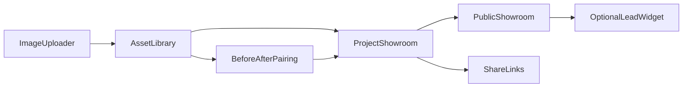

# 이미지 쇼룸 분리 판매 블루프린트

이 문서는 `FINDGAGU OS`에서 `상담관리`를 제외하고 `이미지 자산 관리 + 이미지 쇼룸`만 별도 제품으로 분리 판매하기 위한 실행 기준 문서입니다.

목표는 세 가지입니다.

- 지금 코드베이스에서 무엇을 남기고 무엇을 제외할지 고정하기
- 별도 앱으로 팔 수 있는 MVP 범위를 제품 관점에서 정의하기
- 이후 실제 분리 개발 시 라우트, 모듈, 권한 설계의 기준점으로 쓰기

구현 근거는 아래 파일을 기준으로 정리했습니다.

- `apps/homepage/src/App.tsx`
- `apps/homepage/src/lib/publicData.ts`
- `src/pages/ShowroomPage.tsx`
- `src/pages/ImageAssetViewer.tsx`
- `src/pages/ImageAssetUpload.tsx`
- `src/lib/imageAssetShowroom.ts`
- `src/lib/imageAssetProjectOperations.ts`
- `src/lib/showroomShareService.ts`

## 1. 제품 한 줄 정의

이 제품은 `현장 이미지 업로드 -> 이미지 정리 -> Before/After 쇼룸 생성 -> 공개 공유`까지를 담당하는 `시공사례 자산 운영 앱`입니다.

즉, 내부 운영용 `상담관리 OS`가 아니라 다음 행동에 집중한 앱입니다.

- 담당자는 이미지를 업로드하고 정리한다
- 현장별로 쇼룸을 만든다
- 고객/팀에 링크로 공유한다
- 공개 쇼룸을 통해 사례 신뢰를 만든다

## 2. 판매 가능한 MVP 범위

### 포함

- 이미지 업로드
- 이미지 메타데이터 수정
- 현장 단위 묶음 관리
- Before/After 페어링
- 내부 쇼룸 목록/상세 보기
- 공개 쇼룸 링크 생성
- 공개 카드뉴스/공개 사례 페이지
- 선택 기능: 기본 리드 수집 위젯

### 제외

- 상담 접수/상담 카드/리드 상태 변경
- 견적 금액/견적 PDF/계약/시공 파이프라인
- 대시보드 통계
- 쇼룸 숏츠/광고/케이스 스튜디오
- 관리자 아카이브/마이그레이션/테스트 콘솔
- 채널톡 상담 운영 전체

## 3. 추천 제품 형태

### 제품명 가설

- `Showroom Asset OS`
- `BeforeAfter Showroom`
- `Findgagu Showroom Cloud`

### 핵심 가치

- 흩어진 현장 사진을 `재사용 가능한 자산`으로 바꾼다
- 사례 이미지를 `보여주기용 쇼룸`으로 전환한다
- 영업팀이 아닌 마케팅/디자인 팀도 쉽게 운영할 수 있다

## 4. 현재 코드에서 남길 축

### 그대로 재사용 가능한 축

- 공개 쇼룸 앱
  - `apps/homepage/src/App.tsx`
  - `apps/homepage/src/pages/ShowroomPage.tsx`
  - `apps/homepage/src/lib/publicData.ts`

- 내부 쇼룸/자산 축
  - `src/pages/ShowroomPage.tsx`
  - `src/pages/ImageAssetViewer.tsx`
  - `src/pages/ImageAssetUpload.tsx`
  - `src/lib/imageAssetShowroom.ts`
  - `src/lib/imageAssetProjectOperations.ts`
  - `src/lib/showroomShareService.ts`
  - `src/lib/publicShowroomCardNewsService.ts`

### 분리 시 제거할 축

- `src/pages/ConsultationManagement.tsx`
- `src/hooks/useConsultations.ts`
- `src/pages/DashboardPage.tsx`
- `src/pages/admin/*` 중 쇼룸 숏츠/광고/아카이브/마이그레이션 관련
- `supabase/functions/channel-talk-webhook/index.ts` 의 상담 운영 결합 흐름

## 5. 별도 앱 권장 구조

### 앱 경계

- `showroom-admin-app`
  - 이미지 업로드
  - 자산 관리
  - 프로젝트/스페이스 관리
  - 내부 쇼룸 편집
  - 공개 링크 발급

- `showroom-public-app`
  - 공개 쇼룸 렌더링
  - 공유 링크 렌더링
  - 선택적 문의 수집

## 6. 1차 출시 MVP 라우트 제안

### 내부 앱

- `/login`
- `/assets`
- `/assets/upload`
- `/projects`
- `/projects/:id`
- `/showroom`
- `/showroom/:projectId`
- `/share-links`

### 공개 앱

- `/showroom`
- `/showroom/case/:siteKey`
- `/showroom/cardnews`
- `/share/:token`

## 7. 제품 패키징

### 상품 A. 공개 쇼룸 Lite

대상:
- 포트폴리오/사례 정리가 이미 되어 있는 업체

포함:
- 공개 쇼룸
- 공유 링크
- 공개 사례 상세

제외:
- 내부 자산 업로드/정리
- 협업 도구

### 상품 B. 자산관리 + 공개 쇼룸

대상:
- 현장 이미지가 많고, 사례 정리/재활용 니즈가 큰 업체

포함:
- 상품 A 전부
- 이미지 업로드
- 자산 태깅
- Before/After 페어링
- 프로젝트별 쇼룸 관리

### 상품 C. 자산관리 + 쇼룸 + 리드 수집

대상:
- 공개 쇼룸을 마케팅 채널로 쓰려는 업체

포함:
- 상품 B 전부
- 문의 위젯
- 유입 출처 추적
- 기본 CTA 클릭 추적

## 8. 출시 우선순위

### Phase 1

- 상품 B를 기준 제품으로 잡는다
- 공개 쇼룸과 내부 자산 관리만 판다
- 상담관리 기능은 절대 같이 넣지 않는다

### Phase 2

- 리드 수집을 붙여 상품 C로 확장한다
- 채널톡 또는 간단한 인입 저장 테이블만 연결한다

### Phase 3

- 멀티테넌시와 권한 체계를 안정화한 뒤 SaaS형 운영으로 확장한다

## 9. 추천 판단

- 단기 판매 가능성: 높음
- 단기 구현 난이도: 중간
- 가장 큰 장애물: 기능 구현이 아니라 데이터 경계/권한 경계

따라서 가장 현실적인 다음 단계는:

1. `상담관리 없는 제품 경계`를 먼저 고정하고
2. `프로젝트/스페이스 기반 데이터 모델`로 재구성한 뒤
3. `상품 B`를 1차 판매형으로 설계하는 것입니다.
