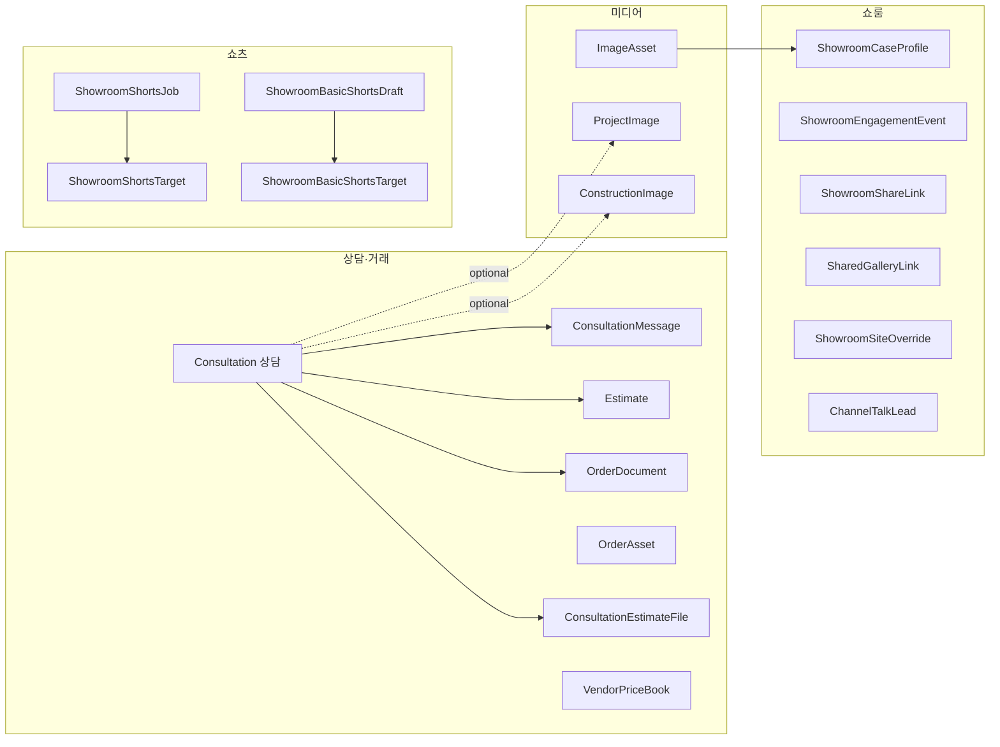

# FINDGAGU OS — 도메인 온톨로지 (1차 초안)

이 문서는 **비즈니스 개념(클래스)·관계·용어**를 한곳에 모은 1차 온톨로지입니다. 구현의 정본은 **Supabase 마이그레이션**이며, `src/types/database.ts`는 생성 시점에 따라 일부 테이블만 포함될 수 있습니다.

## 1. 범위와 목적

- **범위**: 상담·견적·자산·쇼룸·콘텐츠(숏츠·자동화)·유입 추적까지 OS가 다루는 엔티티.
- **목적**: 팀·코드·자동화(n8n, Edge, 워커)가 같은 언어로 도메인을 가리키게 하고, 온보딩·연동·AI 컨텍스트의 기준선으로 쓰기 위함.
- **갱신**: 테이블 추가/의미 변경 시 이 문서의 해당 절만 수정하거나, 주기적으로 마이그레이션과 대조.

## 2. 최상위 도메인(패키지)

| 도메인 | 한 줄 설명 | 대표 저장소(테이블) |
|--------|------------|---------------------|
| **상담·거래** | 프로젝트(상담 단위), 메시지, 견적, 발주·문서 | `consultations`, `consultation_messages`, `estimates`, `order_documents`, `order_assets`, `consultation_estimate_files`, `vendor_price_book` |
| **미디어·현장 자산** | 이미지·시공 사진·채팅 첨부·폴더 매핑 | `image_assets`, `project_images`, `construction_images`, `consultation_messages`(파일은 Storage `chat-media` 버킷), `photo_folder_mappings` |
| **쇼룸·공개** | 공개 쇼룸, 사례, 공유 링크, 리드, 참여 이벤트 | `showroom_case_profiles`, `showroom_engagement_events`, `showroom_share_links`, `shared_gallery_links`, `showroom_site_overrides`, `channel_talk_leads` |
| **쇼츠·배포** | 비포/애프터 숏츠 작업, 기본 쇼츠 초안, 채널별 게시, 로그 | `showroom_shorts_jobs`, `showroom_shorts_targets`, `showroom_shorts_logs`, `showroom_basic_shorts_drafts`, `showroom_basic_shorts_targets`, `showroom_basic_shorts_logs` |
| **콘텐츠 자동화** | 배치 콘텐츠 작업 큐 | `content_automation_jobs` |
| **분석·유입** | CTA·랜딩 방문 | `showroom_cta_visits` |

## 3. 핵심 클래스(개념) ↔ 테이블

아래에서 **클래스**는 온톨로지상 이름, **테이블**은 Postgres 객체 이름입니다.

### 3.1 상담·거래

| 클래스 | 테이블 | 의미 |
|--------|--------|------|
| **상담(프로젝트)** | `consultations` | 운영 단위의 상담/프로젝트. 시트 연동 구조(프로젝트명, 링크, 일자, 상태, 견적가 등). |
| **상담 메시지** | `consultation_messages` | 상담 스레드의 메시지. |
| **견적** | `estimates` | 상담에 귀속되는 견적 레코드. |
| **발주·주문 문서** | `order_documents` | 상담에 연결된 주문/발주 관련 문서 메타. |
| **발주 자산** | `order_assets` | 발주서·배치도 등 `image_assets`와 분리해 관리하는 도면/문서 자산. |
| **상담-견적 파일** | `consultation_estimate_files` | 업로드된 견적서·외주 단가표 등(업로드 유형으로 구분). |
| **외주 단가표(마스터)** | `vendor_price_book` | 원가/단가 참조 데이터. 표시용 플래그 등 메타 포함. |

### 3.2 미디어

| 클래스 | 테이블 | 의미 |
|--------|--------|------|
| **이미지 자산** | `image_assets` | 현장/갤러리 중심 이미지. 상담 연동·쇼룸·품질 점수 등 메타가 많음. |
| **프로젝트 이미지** | `project_images` | 프로젝트 단위 이미지(상담과 선택 연결). |
| **시공 이미지** | `construction_images` | 시공 관련 이미지(상담과 선택 연결). |

### 3.3 쇼룸·공유·리드

| 클래스 | 테이블 | 의미 |
|--------|--------|------|
| **쇼룸 사례 프로필** | `showroom_case_profiles` | 공개 사례 카드/프로필. |
| **쇼룸 참여 이벤트** | `showroom_engagement_events` | 노출·클릭 등 참여 로그. |
| **쇼룸 공유 링크** | `showroom_share_links` | 공유용 URL/토큰 등. |
| **갤러리 공유 링크** | `shared_gallery_links` | 갤러리 범위 공유. |
| **쇼룸 사이트 오버라이드** | `showroom_site_overrides` | 공개 사이트 섹션/키별 표시 덮어쓰기. |
| **채널톡 리드** | `channel_talk_leads` | 채널톡 유입·쇼룸 스코프 연동. |

### 3.4 쇼츠 파이프라인

| 클래스 | 테이블 | 의미 |
|--------|--------|------|
| **숏츠 작업(비포/애프터)** | `showroom_shorts_jobs` | 소스 영상·비포에셋·애프터에셋·채널 요청 등 한 건의 생성 작업. |
| **숏츠 게시 대상** | `showroom_shorts_targets` | 채널별 제목·해시태그·게시 상태·외부 포스트 ID. 작업 1 : N 대상. |
| **숏츠 로그** | `showroom_shorts_logs` | 단계별 처리 로그. |
| **기본 쇼츠 초안** | `showroom_basic_shorts_drafts` | 이미지·스크립트·패키지 텍스트 기반의 기본 쇼츠 편집 단위. |
| **기본 쇼츠 게시 대상** | `showroom_basic_shorts_targets` | 초안당 채널별 게시 메타. |
| **기본 쇼츠 로그** | `showroom_basic_shorts_logs` | 기본 쇼츠 파이프라인 로그. |

### 3.5 기타

| 클래스 | 테이블 | 의미 |
|--------|--------|------|
| **콘텐츠 자동화 작업** | `content_automation_jobs` | 자동화 큐의 작업 단위. |
| **CTA 방문** | `showroom_cta_visits` | 방문자/세션·채널·CTA·랜딩·선택적 콘텐츠 작업·타겟 연결. |
| **사진 폴더 매핑** | `photo_folder_mappings` | 외부 폴더/구조와의 매핑. |

## 4. 관계(요약)

방향은 **주체 → 객체** (UML 스타일 연관). DB FK와 1:1은 아닐 수 있음(앱·RPC에서 연결).

**텍스트 요약**

- 상담(`consultations`)은 메시지·견적·주문문서·견적파일의 중심 노드.
- 이미지 자산은 상담·쇼룸·숏츠(에셋 ID) 등 여러 흐름에서 참조될 수 있음.
- 숏츠: **작업(Job/Draft)** 1건에 **채널별 타겟(Target)** N건; **로그**는 작업(및 선택적 타겟)에 귀속.
- CTA 방문은 콘텐츠 작업 ID·타겟 ID로 숏츠/게시와 느슨하게 연결 가능.

## 5. 용어·별칭 (팀 정렬용)

| 권장 용어 | 비고 |
|-----------|------|
| **상담** | DB `consultations`. “프로젝트”와 혼용되면 문맥에 따라 동의어로 명시. |
| **견적서 파일 vs 외주 단가표** | `consultation_estimate_files.upload_type`: `estimates` / `vendor_price`. |
| **숏츠 작업** | 비포/애프터 파이프라인은 `showroom_shorts_*`, 템플릿형 기본 쇼츠는 `showroom_basic_shorts_*`. |
| **게시 대상** | `*_targets` 테이블 — 채널별 메타·게시 상태. |

## 6. 다음 단계 (선택)

- [ ] 자주 쓰는 **상태값**(`status`, `publish_status` 등)을 열거해 값 온톨로지(열거형 문서)로 확장.
- [ ] 외부 시스템(시트, 채널톡, 클라우디너리)과의 **매핑 표** 추가.
- [ ] 필요 시 RDF/Turtle 등 **기계-readable** 내보내기는 별도 스크립트로 이 문서와 동기화.

---
*문서 버전: v1 · 생성 기준: `supabase/migrations` 및 라우트 라벨(`internalRouteLabel.ts`) · 이후 변경은 PR에서 본 문서 함께 갱신 권장.*
